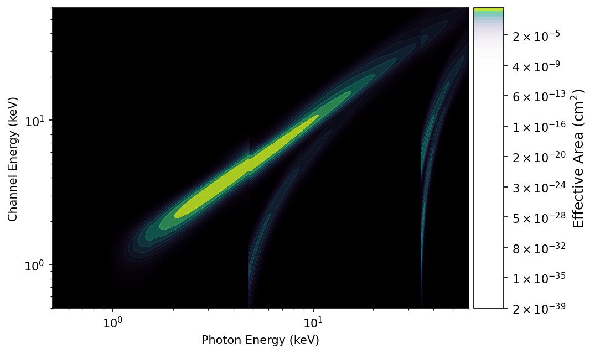
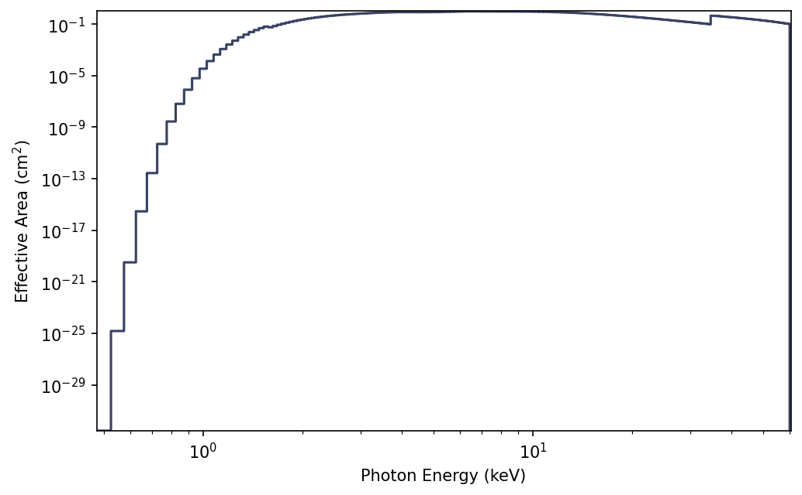

.. _gsc-response:
.. |GscRsp| replace:: :class:`~gdt.missions.maxi.gsc.response.GscRsp`
.. |GscRmf| replace:: :class:`~gdt.missions.maxi.gsc.response.GscRmf`
.. |GscArf| replace:: :class:`~gdt.missions.maxi.gsc.response.GscArf`

.. |ResponseMatrix| replace:: :class:`~gdt.core.data_primitives.ResponseMatrix`
.. |PowerLaw| replace:: :class:`~gdt.core.spectra.functions.PowerLaw`
.. |EnergyBins| replace:: :class:`~gdt.core.data_primitives.EnergyBins`
.. |Bins| replace:: :class:`~gdt.core.data_primitives.Bins`
.. |ResponsePlot| replace:: :class:`~gdt.core.plot.drm.ResponsePlot`
.. |PhotonEffectiveArea| replace:: :class:`~gdt.core.plot.drm.PhotonEffectiveArea`
.. |ChannelEffectiveArea| replace:: :class:`~gdt.core.plot.drm.ChannelEffectiveArea`

*******************************************************************
MAXI/GSC Detector Responses (:mod:`gdt.missions.maxi.gsc.response`)
*******************************************************************

Detector response files allow you to compare a theoretical photon 
spectrum to an observed count spectrum. A detector response matrix (DRM) 
encodes the energy dispersion and calibration of incoming photons at different 
energies to recorded energy channels. The matrix also encodes the effective area 
of the detector as a function of energy for a given source position relative to 
the detector pointing. This effective area can change dramatically as there is 
often a strong angular-dependence of the response (and the angular dependence 
changes with energy!). MAXI responses are expressed in Ancillary Response Files
that contain the effective area as a function of energy and Response Matrix
Files that contain the energy redistribution matrix.  The Ancillary Response and
Response Matrix can be combined to produce a complete detector response as 
detailed below.

Ancillary Response Files
========================
Ancillary Response Files (ARFs) contain the effective area of the detector as
a function of energy.  There are two ARFs for each detector, valid for two 
different high voltage values: 803 and 854. We can read an ARF using the 
|GscArf| class:

    >>> from gdt.core import data_path
    >>> from gdt.missions.maxi.gsc.response import GscArf
    >>> arf_file = data_path / 'maxi-gsc/mx_gsc0_arfcorr_20151126.fits'
    >>> arf = GscArf.open(arf_file)
    >>> arf
    <GscArf(filename="mx_gsc0_arfcorr_20151126.fits") at 0x1070f2040>

We can determine which detector this ARF should be used for:
    
    >>> arf.detector
    'HA0'

We can retrieve the ancillary response for one of the high voltages:

    >>> arf_hv803 = arf.get_arf(803)
    >>> arf_hv803
    <Bins: 1200 bins;
     range (0.475, 60.475)>

This results in a |Bins| object containing the energy edges and the effective
area.

Response Matrix Files
=====================
Response Matrix Files (RMFs) contain the energy redistribution matrix that maps
the incident photon energy to the recorded channel energy.  RMFs are nearly
complete detector responses with only the effective area correction missing. 
MAXI has two different types of RMFs depending on the high voltage value of 
803 or 854.  We use the |GscRmf| class to read these files:

    >>> from gdt.missions.maxi.gsc.response import GscRmf
    >>> rmf_file = data_path / 'maxi-gsc/mx_gsc0_hv854_detxm002_m002.rmf'
    >>> rmf_hv854 = GscRmf.open(rmf_file)
    >>> rmf_hv854
    <GscRmf: mx_gsc0_hv854_detxm002_m002.rmf;
     time range (0.0, 0.0);
     1201 energy bins; 1200 channels>

We can convert this to a full detector response by applying a |GscArf| object.

    >>> rsp = rmf_hv854.apply_arf(arf)
    >>> rsp
    <GscRsp: mx_gsc0_hv854_detxm002_m002.rsp;
     time range (0.0, 0.0);
     1201 energy bins; 1200 channels>

When we apply the ARF, it automatically chooses the one corresponding to the
correct high voltage, applies it to the RMF and returns a complete detector 
response object, |GscRsp|.

Using Detector Responses
=========================

We can access the detector response matrix (DRM) directly, which is a 
|ResponseMatrix| object:

    >>> rsp.drm
    <ResponseMatrix: 1201 energy bins; 1200 channels>

We can fold a photon model through the response matrix to get out a count 
spectrum.  For example, we fold a |PowerLaw| photon model:

    >>> from gdt.core.spectra.functions import PowerLaw
    >>> pl = PowerLaw()
    >>> # power law with amplitude=0.01, index=-2.0
    >>> rsp.fold_spectrum(pl.fit_eval, (0.01, -2.0))
    <EnergyBins: 1200 bins;
     range (0.02500000037252903, 60.025001525878906);
     1 contiguous segments>

This returns an |EnergyBins| object containing the count spectrum.  See 
:external:ref:`Instrument Responses<core-response>` for more information on 
working with single-DRM responses.

What does a DRM actually look like? We can make a plot of one using the 
|ResponsePlot|:

    >>> import matplotlib.pyplot as plt
    >>> from gdt.core.plot.drm import ResponsePlot
    >>> drmplot = ResponsePlot(rsp.drm)
    >>> drmplot.xlim = (0.5, 60.0)
    >>> drmplot.ylim = (0.5, 60.0)
    >>> plt.show()

What we see in the plot is a diagonal edge that contains a majority of the 
effective area. This approximately linear mapping of photon energy to energy 
channel is called the photopeak. There is also a bunch of off-diagonal 
contribution from photons deposited into energy channels lower than the 
original photon energy. This presence of non-negligible off-diagonal response 
is one of the reasons that the DRM is not invertible (our lives would be so 
much easier if was, though). 

We can also make a plot of the effective area integrated over photon energies 
using |PhotonEffectiveArea|:

    >>> from gdt.core.plot.drm import PhotonEffectiveArea
    >>> effarea_plot = PhotonEffectiveArea(rsp.drm)
    >>> plt.show()

For more details about customizing these plots, see 
:external:ref:`Plotting DRMs and Effective Area<plot-drm>`.

Reference/API
=============

.. automodapi:: gdt.missions.maxi.gsc.response
   :inherited-members:

