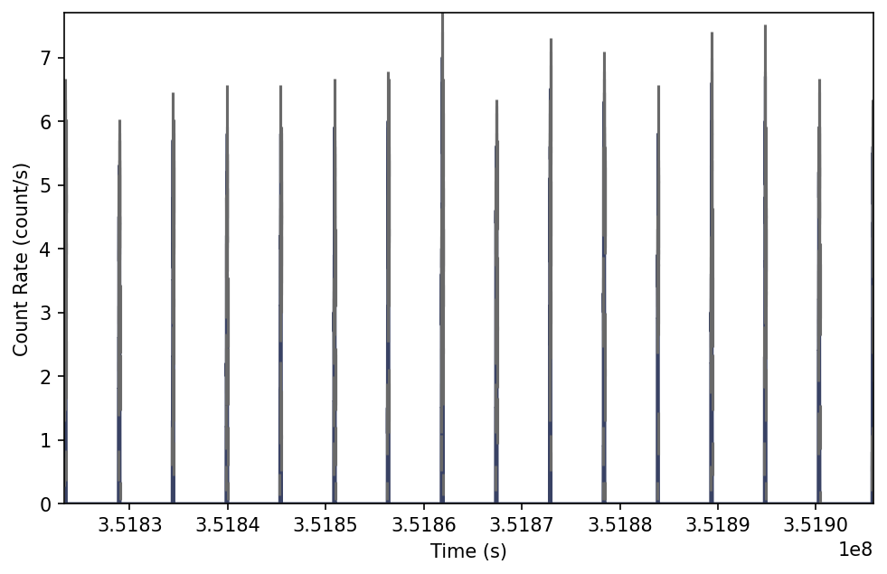
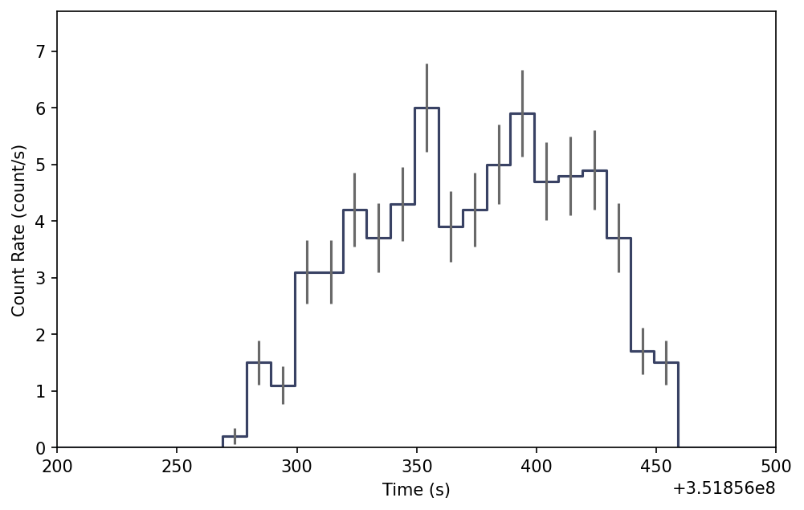
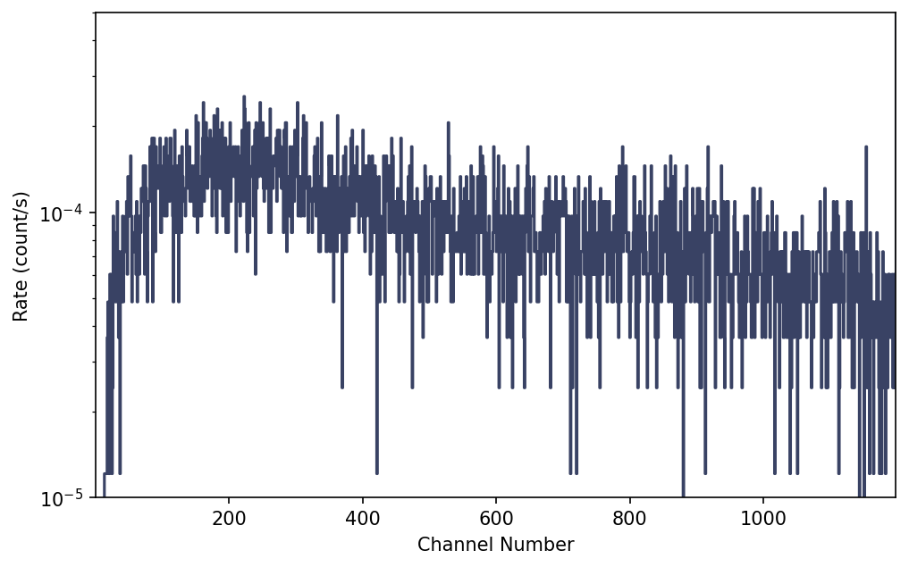
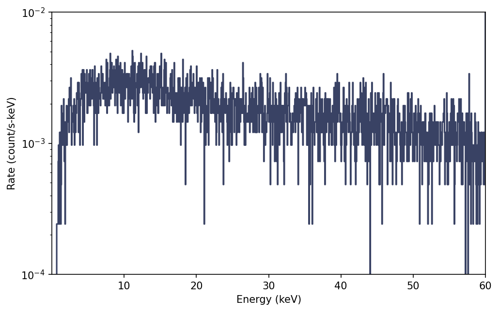

.. _gsc-tte:
.. |GscTte| replace:: :class:`~gdt.missions.maxi.gsc.tte.GscTte`
.. |EventList| replace:: :class:`~gdt.core.data_primitives.EventList`
.. |PhotonList| replace:: :class:`~gdt.core.tte.PhotonList`
.. |bin_by_time| replace:: :func:`~gdt.core.binning.unbinned.bin_by_time`
.. |combine_by_factor| replace:: :func:`~gdt.core.binning.binned.combine_by_factor`
.. |Phaii| replace:: :class:`~gdt.core.phaii.Phaii`
.. |Lightcurve| replace:: :class:`~gdt.core.plot.lightcurve.Lightcurve`
.. |Spectrum| replace:: :class:`~gdt.core.plot.spectrum.Spectrum`

******************************************************
MAXI/GSC Event Data (:mod:`gdt.missions.maxi.gsc.tte`)
******************************************************

The GSC TTE (Time-Tagged Event) data is basically a time-series of "counts" 
where each count is mapped to an energy channel. We can read the TTE files in 
the following way:

    >>> from gdt.core import data_path
    >>> from gdt.missions.maxi.gsc.tte import GscTte
    >>> filepath = data_path / 'maxi-gsc' / 'mx_mjd55616_gsc_med_000.evt.gz'
    >>> tte = GscTte.open(filepath)
    >>> tte
    <GscTte: mx_mjd55616_gsc_med_000.evt.gz;
     time range (351823349.07326806, 351905899.23335385);
     energy range None>

..  Note::
   While MAXI is an imager, and each event contains spatial information, the
   current version of the GDT does not process the spatial component of each
   event.  This is a general capability planned for a future release.

Note that the energy range is ``None``.  There is no energy calibration within
this file, therefore the events can only be used in channel space unless we
apply an energy calibration. Since this data is in the FITS format, the data 
files have multiple data extensions, each with metadata information in a header. 
You can access this metadata information:

    >>> tte.headers.keys()
    ['PRIMARY', 'EVENTS', 'STDGTI']
    
There is easy access for certain important properties of the data:

    >>> # the good time intervals for the data
    >>> tte.gti
    <Gti: 33 intervals; range (351820802.75406253, 351906337.324411)>
        
    >>> # the time range
    >>> tte.time_range
    (351823349.07326806, 351905899.23335385)
        
    >>> # number of energy channels
    >>> tte.num_chans
    1187

We can retrieve the time-tagged events data contained within the file, which
is an |EventList| class (see 
:external:ref:`Event Data<core-data_primitives-event>` for more details).

    >>> tte.data
    <EventList: 11197 events;
     time range (351823349.07326806, 351905899.23335385);
     channel range (13, 1199)>

Through the |PhotonList| base class, there are a lot of high level functions 
available to us, such as slicing the data in time or energy channel:

    >>> time_sliced_tte = tte.slice_time((351823349, 351823549))
    >>> time_sliced_tte
    <GscTte: 
     time range (351823349.07326806, 351823538.85162055);
     energy range None>

    >>> channel_sliced_tte = tte.slice_energy((50, 300))
    >>> channel_sliced_tte.data.channel_range
    (50, 300)

To make a lightcurve using TTE data, we need to temporally bin the data, and
then we can plot it. Here, we want to bin unbinned data, so we choose from the 
:external:ref:`Binning Algorithms for Unbinned Data<binning_unbinned>`. For
this example, let's choose |bin_by_time|, which simply bins the TTE to the
prescribed time resolution.  Then we can use our chosen binning algorithm to
**convert** the TTE to a PHAII object

    >>> from gdt.core.binning.unbinned import bin_by_time
    >>> phaii = tte.to_phaii(bin_by_time, 10.0)
    >>> phaii
    <Phaii: 
     time range (351823349.07326806, 351905909.07326806);
     energy range None>

Here, we binned the data to 10 second resolution.  Now that it is 
a |Phaii| object, we can do all of the same operations that we could 
with standard PHAII data.  For example, we can plot the lightcurve using the 
|Lightcurve| class:

    >>> import matplotlib.pyplot as plt
    >>> from gdt.core.plot.lightcurve import Lightcurve
    >>> lcplot = Lightcurve(data=phaii.to_lightcurve())
    >>> plt.show()
    

Initially, this lightcurve looks odd, but that is because the data covers an 
entire data, there are several periods where no data is being taken over that
part of the sky.  We can zoom in a bit to see one of the regions that has data:

    >>> lcplot.xlim = (351856200.0, 351856500.0)
    

    
One thing to note, if we want to temporally rebin the data, we could certainly 
rebin the PHAII object, but in order to leverage the full power and flexibility 
of TTE, it would be good to (re)bin the TTE data instead to create a new PHAII
object.

To plot the spectrum, we don't have to worry about binning the data, since the 
TTE is already necessarily pre-binned in energy. So we can make a spectrum plot 
directly from the TTE object without any extra steps using the |Spectrum| 
class:

    >>> from gdt.core.plot.spectrum import Spectrum
    >>> spectrum = tte.to_spectrum()
    >>> specplot = Spectrum(data=spectrum)
    >>> specplot.errorbars.hide()
    >>> specplot.ylim = (1e-5, 5e-4)
    >>> plt.show() 

Now this plot is only showing us the count rate in each channel. If we
have an energy calibration (for example from an RMF file), we can apply that
calibration to our |GscTte| object and plot an energy spectrum (see 
:ref:`MAXI/GSC Detector Responses<gsc-response>` for details on RMFs):

    >>> rmf803_file = data_path / 'maxi-gsc/mx_gsc0_hv803_detx0000_0000.rmf'
    >>> from gdt.missions.maxi.gsc.response import GscRmf
    >>> rmf = GscRmf.open(rmf803_file)
    >>> tte.set_ebounds(rmf.ebounds)
    >>> tte
    <GscTte: mx_mjd55616_gsc_med_000.evt.gz;
     time range (351823349.07326806, 351905899.23335385);
     energy range (0.675000011920929, 60.025001525878906)>

This updates our eventlist with an energy calibration, and now we can plot an
energy spectrum:

    >>> spectrum = tte.to_spectrum()
    >>> specplot = Spectrum(data=spectrum)
    >>> specplot.errorbars.hide()
    >>> specplot.xscale = 'linear'
    >>> specplot.ylim = (1e-4, 1e-2)
    >>> plt.show()

See :external:ref:`Plotting Lightcurves<plot-lightcurve>` and 
:external:ref:`Plotting Count Spectra<plot-spectrum>` for more on how to modify 
these plots.
    
For more details about working with TTE data, see 
:external:ref:`Photon List and Time-Tagged Event Files<core-tte>`.

    
Reference/API
=============

.. automodapi:: gdt.missions.maxi.gsc.tte
   :inherited-members:

