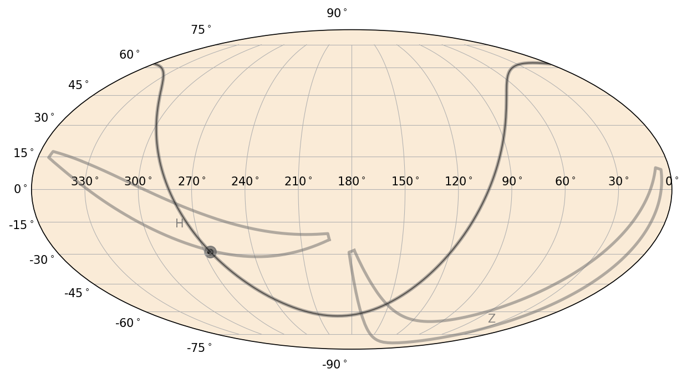
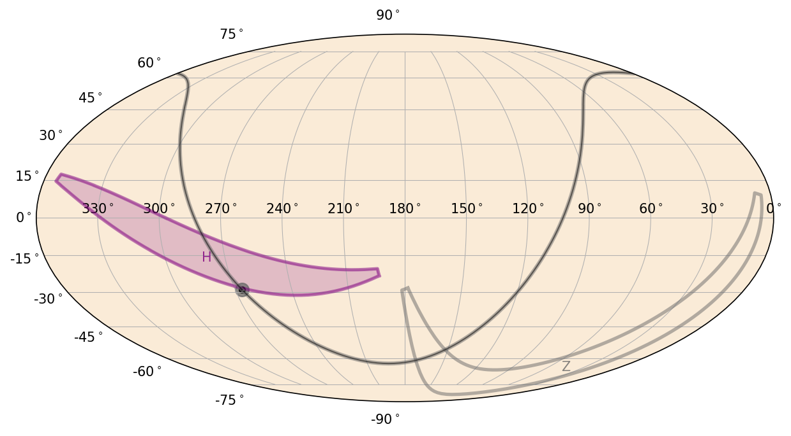

.. _maxi-plot:
.. |MaxiSkyPlot| replace:: :class:`~gdt.missions.maxi.plot.MaxiSkyPlot`
.. |MaxiEquatorialPlot| replace:: :class:`~gdt.missions.maxi.plot.MaxiEquatorialPlot`
.. |MaxiGalacticPlot| replace:: :class:`~gdt.missions.maxi.plot.MaxiGalacticPlot`
.. |MaxiSpacecraftPlot| replace:: :class:`~gdt.missions.maxi.plot.MaxiSpacecraftPlot`
.. |MaxiDetectorFov| replace:: :class:`~gdt.missions.maxi.plot.MaxiDetectorFov`
.. |MaxiFrame| replace:: :class:`~gdt.missions.maxi.frame.MaxiFrame`
.. |GscFov| replace:: :class:`~gdt.missions.maxi.gsc.detectors.GscFov`

.. |SkyPolygon| replace:: :class:`~gdt.core.plot.plot.SkyPolygon`
.. |SkyPlot| replace:: :class:`~gdt.core.plot.sky.SkyPlot`

**************************************************************
MAXI Custom Plot Classes (:mod:`gdt.missions.maxi.plot`)
**************************************************************
There are a few MAXI-specific plot classes that extend the functionality of  
those provided in :external:ref:`The Plot Package<plot>`.  These classes 
primarily augment the plotting of the MAXI/GSC fields-of-view (FOVs) on the sky, 
with a plot class that draws a GSC FOV on a sky plot (|MaxiDetectorFov|) and
a base class sky plot, |MaxiSkyPlot|, that enables the plotting of the FOV 
object.

We can initialize the |MaxiSkyPlot| by calling it in the same way that we 
create a |SkyPlot| object.  |SkyPlot|, itself, is a base class for plotting in
equatorial, Galactic, and spacecraft coordinates, and there are sub-classed
MAXI plot classes that we can use.  For example, if we want to plot in the ICRS
frame, we use |MaxiEquatorialPlot|:

    >>> import matplotlib.pyplot as plt
    >>> from gdt.missions.maxi.plot import MaxiEquatorialPlot
    >>> eqplot = MaxiEquatorialPlot(interactive=True)
    >>> plt.show()

Then, we can plot one of the GSC FOVs using the |MaxiDetectorFov|, which is
a special type of |SkyPolygon|. The polygon is defined by |GscFov| (see 
:ref:`MAXI/GSC Detector Definitions<gsc-detectors>` for details), which requires
a |MaxiFrame| that defines how the FOV is rotated from the MAXI reference frame
into the celestial frame.  We will use the example frame used 
:ref:`here<gsc-frame>` and make one small change to add the GSC FOV definitions
to the frame so that the plotter knows how to rotate and plot the FOVs:

    >>> from gdt.core.coords import Quaternion
    >>> from gdt.missions.maxi.frame import MaxiFrame
    >>> from gdt.missions.maxi.gsc.detectors import GscFov
    >>> quat = Quaternion([-0.218,  0.009,  0.652, -0.726])
    >>> maxi_frame = MaxiFrame(quaternion=quat, detectors=GscFov)

Finally, we add the frame we created to our plot:

    >>> eqplot.add_frame(maxi_frame, earth=False, sun=False)

This plots the GSC-H and GSC-Z FOVs on the sky in RA/Dec.  You will also notice
the curve and point denoting the Galactic Plane and Center.  We set keywords
to not plot the sun or location of the Earth from the MAXI point-of-view; to 
plot those, we would need to set the `obstime` and `obsgeoloc` properties of
the frame (see :ref:`Maxi Orbit Files<maxi-orbit>` and 
:ref:`Maxi Attitude Files<maxi-attitude>` for more information).

The plot objects for the field of view can be accessed in the following way:

    >>> eqplot.detectors
    <PlotElementCollection: 2 MaxiDetectorFov objects>
    
    >>> eqplot.detectors.H
    <MaxiDetectorFov: 'H';
                      face_color=dimgray;
                      face_alpha=0.0;
                      edge_color=dimgray;
                      edge_alpha=0.5;
                      linestyle='-';
                      linewidth=2.5;
                      fontsize=10;
                      font_color=dimgray;
                      font_alpha=0.8>

    >>> eqplot.detectors.Z
    <MaxiDetectorFov: 'Z';
                      face_color=dimgray;
                      face_alpha=0.0;
                      edge_color=dimgray;
                      edge_alpha=0.5;
                      linestyle='-';
                      linewidth=2.5;
                      fontsize=10;
                      font_color=dimgray;
                      font_alpha=0.8>

There are a number of properties we can change.  For example, we can change
the GSC-H FOV into a filled polygon with a purple color:

    >>> eqplot.detectors.H.face_alpha = 0.2
    >>> eqplot.detectors.H.face_color = 'purple'
    >>> eqplot.detectors.H.edge_color = 'purple'
    >>> eqplot.detectors.H.font_color = 'purple'

For more information on plotting objects on the sky, see 
:external:ref:`Plotting Sky Maps, Localizations, and Wide-field Effective Areas<plot-sky>`.

Reference/API
=============

.. automodapi:: gdt.missions.maxi.plot
   :inherited-members:

